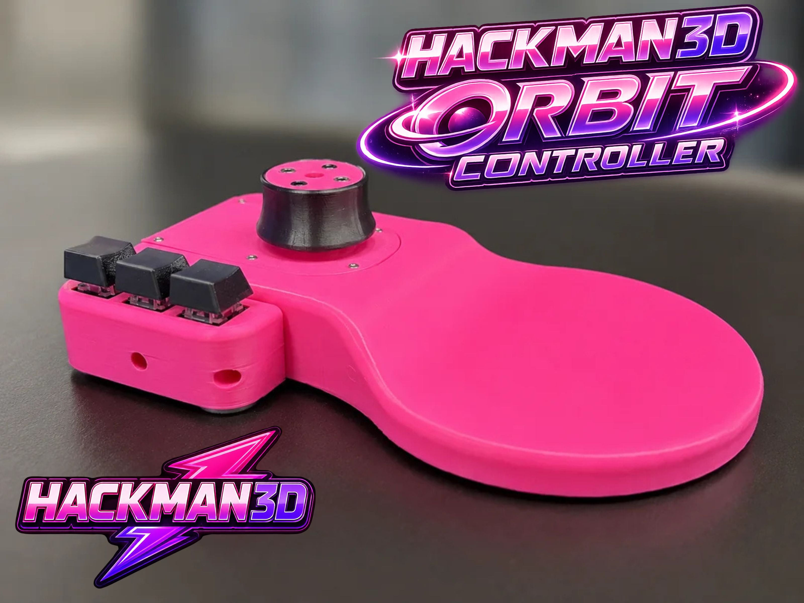

# Orbit Controller SpaceMouse Pro - ESP32-S3 Edition

  

Welcome to the **ESP32-S3** version of the Orbit Controller. This project is an advanced DIY firmware to create your own 6-degrees-of-freedom (6-DOF) 3D mouse, designed to offer a native and smooth experience in CAD and 3D modeling software.

This code builds upon the excellent mathematical logic of the original Hackman3D project (designed for the Arduino Pro Micro) but has been rewritten and optimized to leverage the superior hardware of the **ESP32-S3 via a wired USB connection**.

---

## The ESP32-S3 Advantage

Migrating to the ESP32-S3 wasn't just a board change; it was a leap in device precision:

* **12-bit Resolution (The biggest upgrade):** While traditional Arduinos read joysticks with a 10-bit analog resolution (values from 0 to 1023), the ESP32-S3 uses a 12-bit ADC (values from 0 to 4095). This provides 4 times smoother movement. All sensitivity thresholds and deadzones from the original code were mathematically scaled to take advantage of this pinpoint accuracy.
* **Native USB (TinyUSB):** The firmware uses the high-performance `Adafruit_TinyUSB` library to manage HID communication. A smart blocking logic (`while (!usb_hid.ready())`) was implemented to prevent dropping asynchronous USB packets, ensuring the computer receives translation and rotation data in perfect order.

## Native 3DxWare Integration

The main goal of this firmware is to achieve a professional "Plug & Play" experience. 

The controller perfectly emulates the identity of an official 3Dconnexion **SpaceMouse Pro** or **SpaceMouse Compact**

**Key recommendation:** It is strongly recommended to install the official **3DxWare** driver on your PC. By doing so, the driver will detect the Orbit Controller as original equipment, allowing you to:
* Assign macros and native commands to physical buttons directly from the official graphical interface.
* Change axis and sensitivity settings per application (Fusion 360, Blender, SolidWorks, etc.) without touching a single line of code.

---

## Main Code Features

* **Dominant Axis Filter:** Configurable option (`ENABLE_DOMINANT_AXIS_FILTER`) to prioritize the strongest movement and discard the rest. Ideal for avoiding unwanted diagonal movements while modeling.
* **Rotation Priority:** Anti-drift logic that detects if the main intention is to rotate, suppressing accidental ghost translations.
* **Z-Push & Twist Detection:** Algorithm that analyzes the simultaneous movement of 3 or more Hall effect sensors/potentiometers to infer clean elevation (Z) or twist (Z Rotation) movements.
* **Slicer Mode (Experimental):** A secondary mouse emulation and keyboard shortcut mode, designed to be used in slicer software that lacks native support for 3D joysticks.

---

## Wiring Guide

To keep this document clean, all information regarding the pins used for the 4 joysticks (8 axes) and the exact button map to emulate the SpaceMouse Pro can be found in the [WIRING.md](Wiring/Wiring Guide - ESP32-S3.md) file.

---

## Features

* 6 Degrees of Freedom (6-DOF)
* Hall Effect joystick technology
* ESP32-S3 based firmware
* Adjustable speed profiles and response curve
* Configurable multi-axis movement filtering
* Optional slicer mouse emulation mode
* USB-C connectivity
* Fully 3D printable design
* Optional mechanical shortcut buttons
* Open-source hardware and firmware
* Compatible with Windows, macOS, and Linux

---

## Repository Contents

| Folder | Description |
|--------|-------------|
| Firmware | Arduino source code |
| BOM | Complete Bill of Materials |
| Wiring | Wiring diagrams |
| Documentation | Assembly and installation guides |

---

## Hardware Requirements

* Espressif ESP32-S3 USB-C
* 4× Hall Effect joystick modules (JH16 joystick hall effecct)
* Optional mechanical keyboard switches (many Mechanical Switchs)
* Dupont wires female to female 15cm
* Standard metric screws (M2 Countersunk and M3 Socket Head)
* 4x M2x10 / 6x M2x6 / 4x M3x6 / 2x M3x8 / 4x M3x10 / 1x M3x12
* USB-C cable (1m or 2m)
* 3D printed parts

A complete list of components is available in the **BOM** pdf.

---

## Software Requirements

* Arduino IDE
* Required board package
* 3Dconnexion Driver (Windows, macOS, Linux)

---

## Compatible Applications

Works with most software supporting 3Dconnexion devices, including:

- Fusion 360
- Blender
- SolidWorks
- FreeCAD
- Onshape
- Autodesk Inventor
- Rhino
- Bambu Studio
- Cura
- PrusaSlicer
- and many more.

For slicers with limited native 3D mouse support, the firmware also includes an optional mouse emulation mode.
This mode sends mouse drag, wheel zoom, and configurable keyboard shortcuts instead of 3Dconnexion movement reports.

---

## Slicer Mouse Mode

Hold buttons `2 + 3` together to switch between normal CAD mode and slicer mouse mode.

Default slicer shortcuts:

| Button | Short press | Long press |
|--------|-------------|------------|
| 1 | Tab | Cmd + Shift + G |
| 2 | N | L |
| 3 | Cmd + 0 | A |

Pressing all three buttons still changes the speed profile.

---

## Operating System Compatibility

| Operating System | Status |
|------------------|--------|
| Windows | ✅ Supported |
| macOS | ✅ Supported |
| Linux | ✅ Supported |

---

## Getting Started

1. Print all required parts.
2. Purchase the components listed in the BOM.
3. Assemble the controller following the documentation.
4. Upload the firmware to the Arduino Pro Micro.
5. Install the required driver.
6. Enjoy your new DIY 3D navigation controller!

---

## STL Files

The complete set of printable STL files is available on Creality Cloud and makerworld :

👉 **https://www.crealitycloud.com/model-detail/hackman3d-orbit-controller**

👉 **https://makerworld.com/fr/models/3009119**

If you enjoy the project, don't hesitate to leave a ❤️, download the files, and share your makes!

---

## Open Source Philosophy

This project is intended to be built, modified and improved by the community.

Feel free to fork it, adapt it to your needs, and share your own improvements.

Every contribution helps make the project better.

---

## License

The firmware contained in this repository is released under the **GNU General Public License v3.0 (GPL-3.0)**.

3D printable files may be distributed under a separate license. Please refer to the STL repository for licensing information.

---